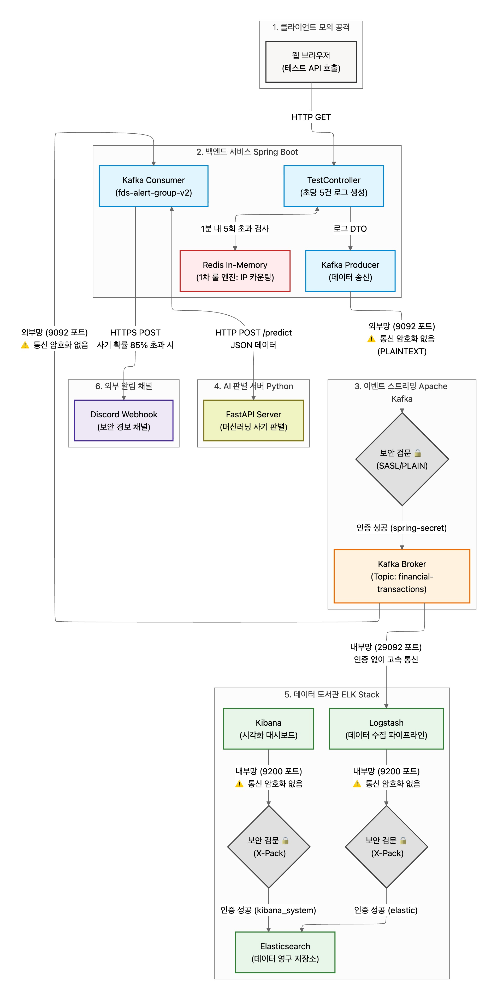

# 🛡️ Sentinel-FDS: 실시간 이상 금융 거래 탐지 파이프라인

## 📝 프로젝트 소개
카카오뱅크, 토스뱅크와 같은 대규모 금융 서비스에서 발생하는 트래픽을 모방하여, 실시간 계좌 이체 및 로그인 로그를 생성하고 **Apache Kafka**를 통해 스트리밍하는 **데이터 수집/발행 엔진**입니다. 단순한 로그가 아닌 무차별 대입 공격, 보이스피싱, 계좌 탈취(Account Takeover) 등의 **보안 위협 시나리오**를 주입하여 실전 데이터 엔지니어링 및 보안 관제(SIEM) 환경을 구현했습니다.

## 🎯 기술 스택
* **Backend:** Java 17, Spring Boot 3.2
* **Data Pipeline:** Apache Kafka (Confluent), Zookeeper
* **Infrastructure:** Docker, Docker Compose

## 💡 직무 역량 매칭 (JD)
* **보안 로그 파이프라인 개발:** 비동기 논블로킹 방식으로 대용량 트래픽에 대응하는 Kafka Producer 구현 (데이터 유실 방지를 위한 `acks=all` 적용).
* **보안 도메인 지식:** 단순 에러 로그가 아닌, 금융 도메인에 특화된 FDS(Fraud Detection System) 이벤트 객체(IP, 금액, 기기 정보) 설계 및 공격 시나리오 구현.
* **인프라 활용 역량:** 로컬 환경에 의존하지 않고 Docker-compose를 활용하여 완벽히 격리되고 재생산 가능한 인프라스트럭처 구축.

## 🚀 실행 방법 (How to Run)

**1. 인프라 실행 (Kafka & Zookeeper)**
```bash
docker-compose up -d
```

